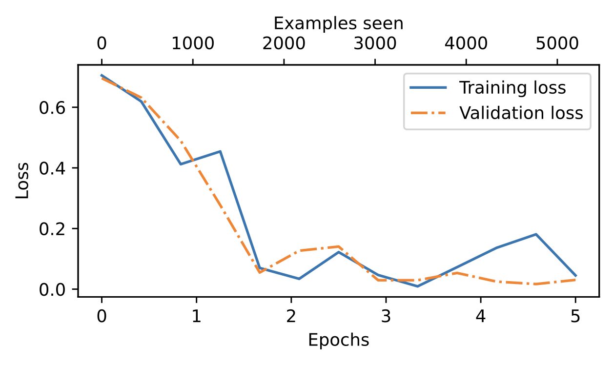
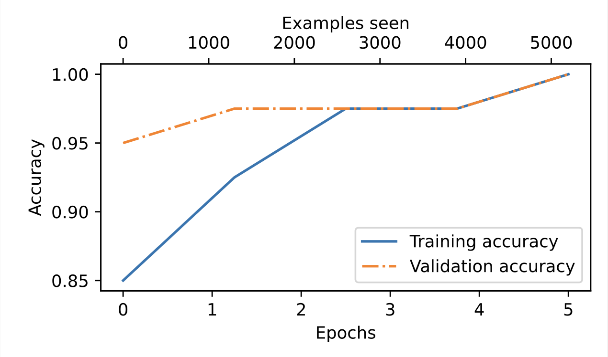

# GPT-2 Inspired Spam/Ham Email Classifier

This project demonstrates building a GPT-2 style language model from scratch, pretraining it on a small dataset, and then fine-tuning it for binary text classification (Spam vs Ham).

The workflow is inspired by Sebastian Raschka's *"Building Large Language Models From Scratch"* and implemented in PyTorch.

---

## 📌 Project Overview

1. **Pretraining**: Implemented a GPT-2 style transformer architecture and pretrained it on the open-source book *"The Verdict"* for next-word prediction.
2. **Fine-tuning**: Loaded pretrained GPT-2 (124M) parameters from OpenAI, froze all layers except:
   - Last transformer layer
   - Final normalization layer
   - Output layer
3. **Classification Task**: Fine-tuned for spam vs ham classification using a balanced dataset.

---

## 📂 Dataset

### Pretraining
- **Source**: *"The Verdict"* (public domain book)
- **Purpose**: Next-word prediction (small dataset — hence limited results)

### Fine-tuning
- [**Spam/Ham Dataset**](https://archive.ics.uci.edu/static/public/228/sms+spam+collection.zip)

- **Labels**:
  - `0`: Ham (Not Spam)
  - `1`: Spam
- **Split**:
  - Train: 70%
  - Validation: 10%
  - Test: 20%

---

## 🛠 Model Architecture

- **Base**: GPT-2 architecture (124M parameters)
- **Framework**: PyTorch
- **Training**:
  - Optimizer: AdamW
  - Pretraining LR: 0.0004
  - Fine-tuning LR: 5e-5
  - Weight decay: 0.1
  - Batch size: Custom (dependent on GPU memory)

---

## 📊 Results

| Dataset      | Accuracy |
|--------------|----------|
| Training     | 97.98%   |
| Validation   | 97.33%   |
| Test         | 96.66%   |

---

## 💻 Installation

```bash
# Clone the repository
git clone https://github.com/divyansh-iitk/Large-Language-Model-from-scratch.git
cd Large-Language-Model-from-scratch

# Create virtual environment
python -m venv venv
source venv/bin/activate  # On Windows: venv\Scripts\activate

# Install dependencies
pip install -r requirements.txt
```

---

## 🚀 Usage

### Pretraining
```bash
jupyter notebook Pretrained_GPT_MODEL.ipynb
```
This will:
- Create dataset/dataloader for *"The Verdict"*
- Train GPT-2 style model for next-word prediction

### Fine-tuning
```bash
jupyter notebook spam_classification.ipynb
```
This will:
- Load GPT-2 124M pretrained weights
- Freeze all but final layers
- Train spam/ham classifier
- Output accuracy metrics

---

## 📌 Example Classification

```python
Text1 = "Congratulations! You’ve won a $500 gift card. Click here to claim your prize now!"
Text2 = "Hey, are we still meeting at the library at 5 pm today?"

label1 = classify_email(Text1, model, tokenizer, train_dataset.max_length)
label2 = classify_email(Text2, model, tokenizer, train_dataset.max_length)

print(f"Text1 is {label1}")  # Spam
print(f"Text2 is {label2}")  # Ham
```

---

## 📈 Training Plots

Loss and Accuracy plots of Fine-tuning:
  
  
---

## 📜 License

This project is licensed under the MIT License - see the [LICENSE](LICENSE) file for details.

---

## 🙏 Acknowledgements

- Sebastian Raschka's book: *"Building Large Language Models From Scratch"*
- OpenAI GPT-2 124M parameters
- PyTorch team
